# Lasercut collection

My lasercut boxes collection designed in OpenSCAD with the [lasercut](https://github.com/bmsleight/lasercut) tool.

## Exporting to DXF

The `convert-2d.sh` script converts an OpenSCAD file to the corresponding DXF file to be imported in a lasercut machine.

```
./convert-2d.sh <filename.scad>
```


## Flashlight

Sources: [Lampa.scad](./Lampa.scad)

A flashlight originally designed in HackLab Kyiv.

<table>
  <tr>
    <td>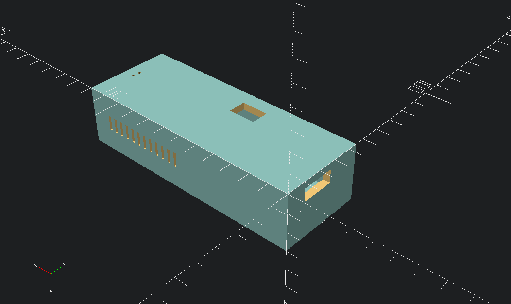</td>
    <td>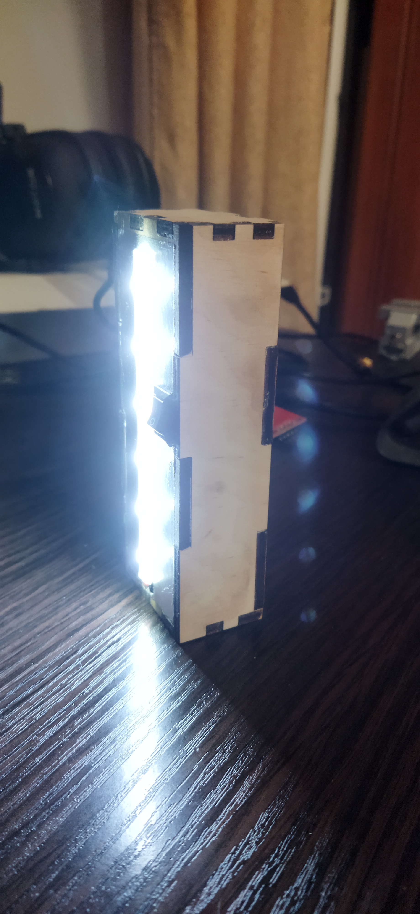</td>
    <td>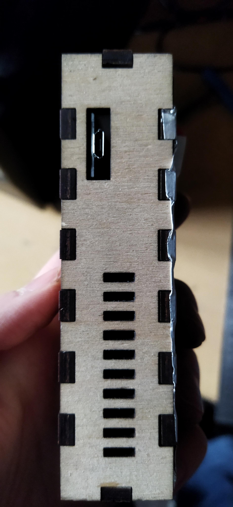</td>
  </tr>
</table>


## A case with an opening transparent panel

Sources: [SDP-box.scad](./SDP-box.scad)

<table>
  <tr>
    <td>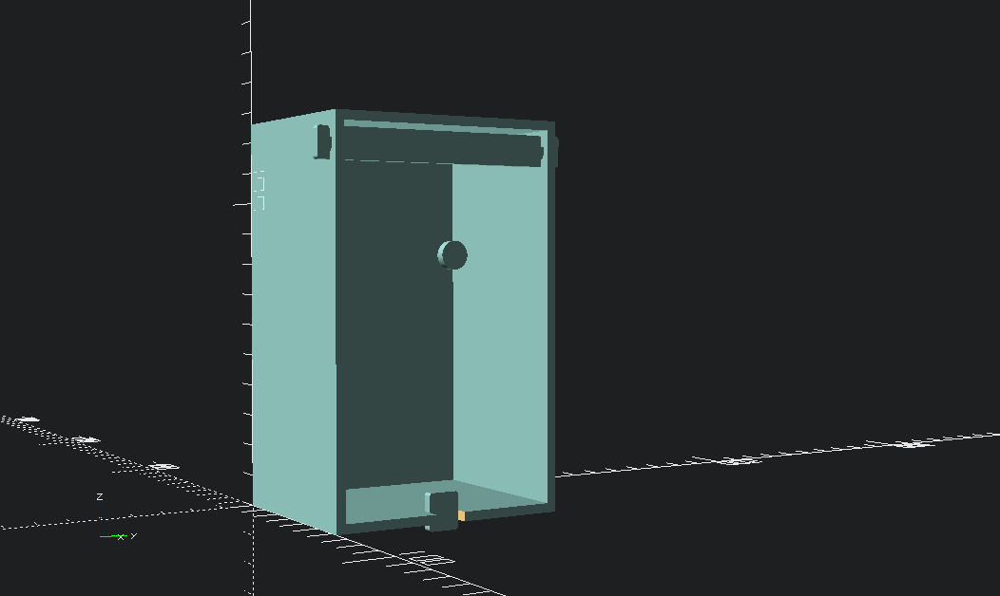</td>
    <td>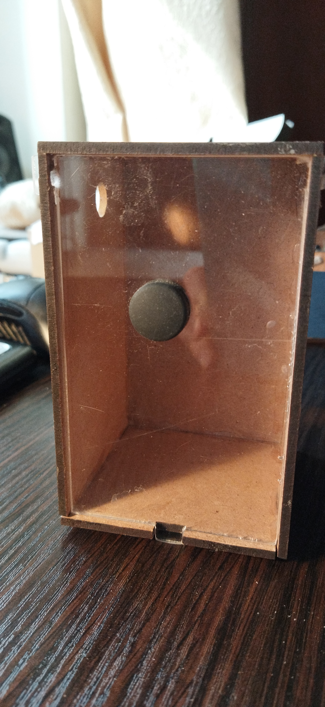</td>
    <td>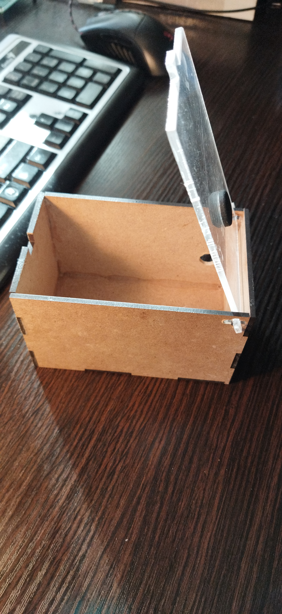</td>
  </tr>
</table>


## Drawer partition

Sources: [drawer-partition.scad](./drawer-partition.scad)

Ordered an organizer that comes with no divider partitions? No problem. Grab any carton box and lasercut it in partitions.

<table>
  <tr>
    <td></td>
    <td>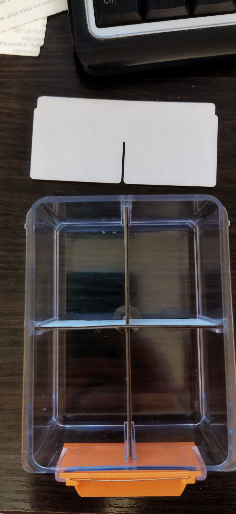</td>
  </tr>
</table>


## Router case

Sources: [router-case.scad](./router-case.scad)

A box for my router, speaker, and digital oscilloscope.

<table>
  <tr>
    <td>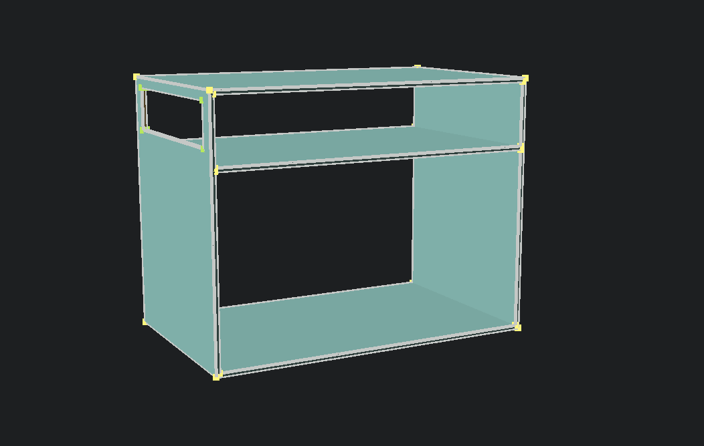</td>
    <td>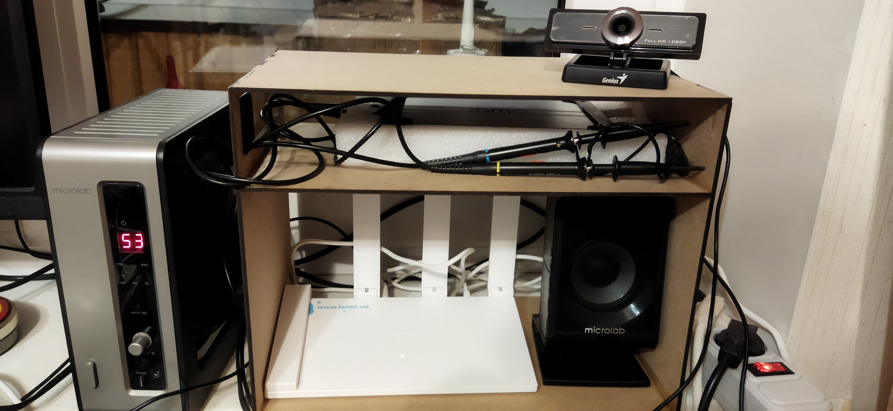</td>
  </tr>
</table>


## DPS3005 power supply

Sources: [DPS3005.scad](./DPS3005.scad)

Step-down power supply case with banana output plugs.

<table>
  <tr>
    <td>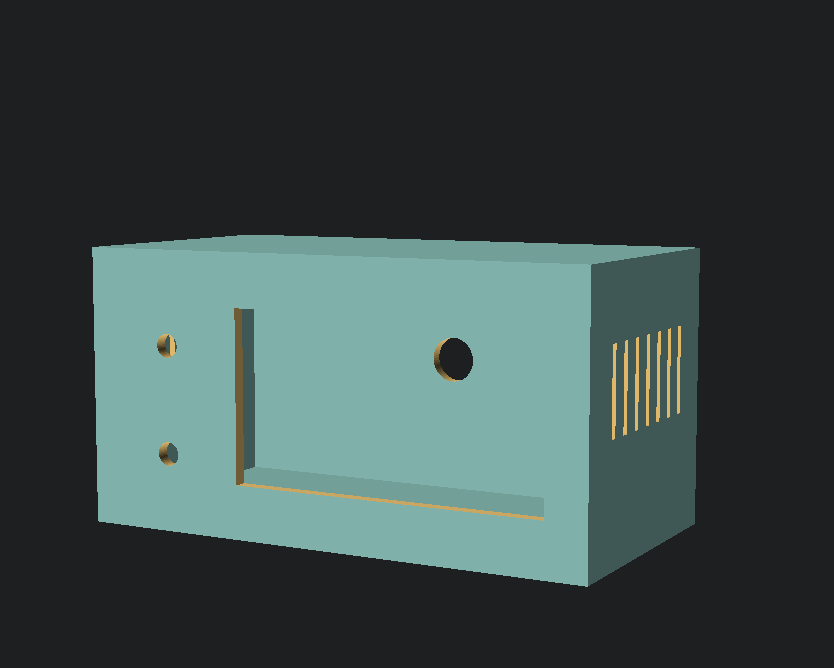</td>
    <td>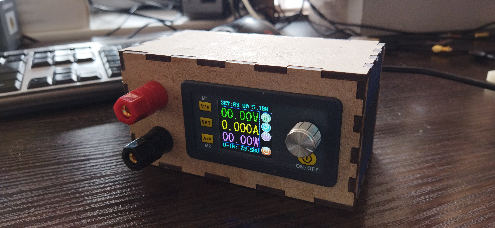</td>
  </tr>
</table>

