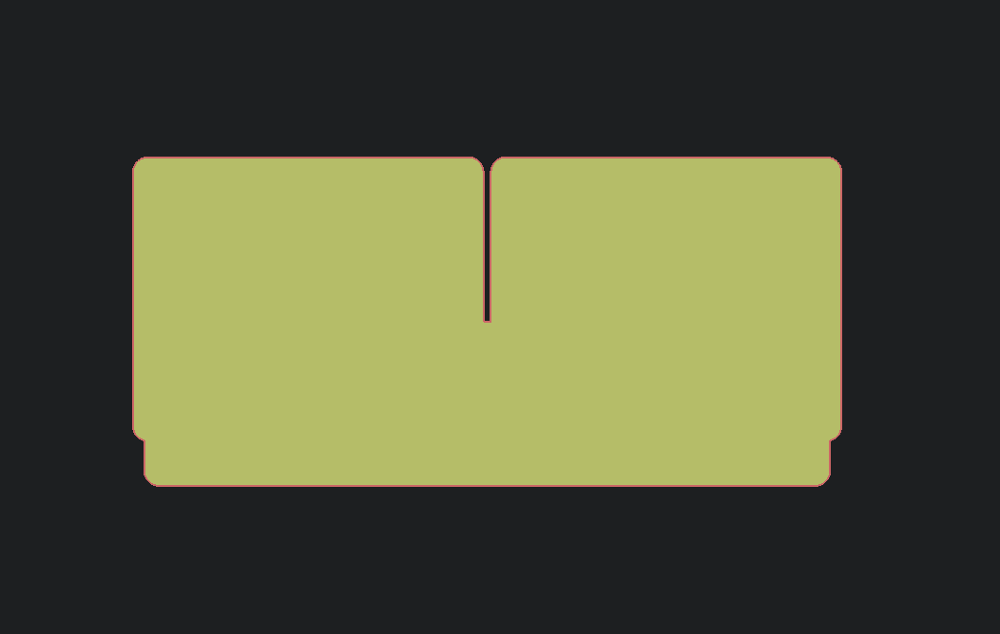

# Lasercut collection

My lasercut boxes collection designed in OpenSCAD with the [lasercut](https://github.com/bmsleight/lasercut) tool.

## Flashlight

Sources: [Lampa.scad](./Lampa.scad)

A flashlight originally designed in HackLab Kyiv.

<table style="width:100%">
  <tr>
    <td></td>
    <td></td>
    <td></td>
  </tr>
</table>

## A case with an opening transparent panel

Sources: [SDP-box.scad](./SDP-box.scad)

<table style="width:100%">
  <tr>
    <td></td>
    <td></td>
    <td></td>
  </tr>
</table>

## Drawer partition

Sources: [drawer-partition.scad](./drawer-partition.scad)

Ordered an organizer that comes with no divider partitions? No problem. Grab any carton box and lasercut it in partitions.

<table style="width:100%">
  <tr>
    <td></td>
    <td></td>
  </tr>
</table>

## Router case

Sources: [router-case.scad](./router-case.scad)

A box for my router, speaker, and digital oscilloscope.

<table style="width:100%">
  <tr>
    <td></td>
    <td></td>
  </tr>
</table>

